# BoulangeHery

Web application for running a bakery: recipes (ingredients, steps, prices), customer
reviews, sales, stock, seller commissions and price history.

It is a deliberately plain **Java servlet application** — no Spring, no ORM, no
dependency manager and no build tool beyond `javac` and `jar`. Data access is
hand-written JDBC, views are JSP, and the business rules that must never be
bypassed (stock, change due, commissions, price history) are enforced by
PostgreSQL triggers rather than by Java code.

> The user interface and the source comments are in French. Everything in this
> document is in English.

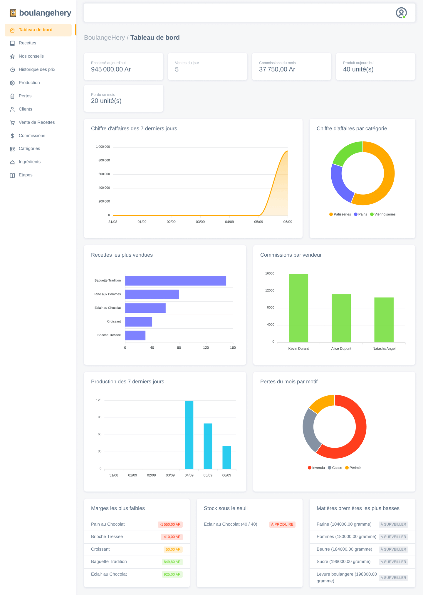

## Contents

- [Features](#features)
- [Roles](#roles)
- [Tech stack](#tech-stack)
- [Getting started](#getting-started)
- [User accounts](#user-accounts)
- [Verifying the database rules](#verifying-the-database-rules)
- [Architecture](#architecture)
- [Security](#security)
- [Database](#database)
- [Project layout](#project-layout)
- [URL map](#url-map)

## Features

### Dashboard

Everything the triggers compute all day was only readable one list at a time.
The dashboard aggregates it in the database -- one query per indicator: revenue
over the last seven days and per category, best sellers, commissions per seller,
production, losses by reason, the thinnest margins, the recipes that fell to
their alert threshold and the lowest raw materials.

It follows the signed-in role rather than merely hiding tiles: a baker's request
never computes revenue, a seller's never computes stock.

### Recipes and multi-criteria search

Recipes carry a category, a flavour, a price, a picture, an author and a
preparation time. The preparation time is **not** entered by hand: a trigger
keeps it equal to the sum of the recipe's steps, and the author is an account
rather than a typed-in name.

Each card also shows what the recipe **costs to make** and the margin it leaves:
the ingredient prices and quantities were already stored but never multiplied. A
`recipe_cost` view sums them, so the figure follows any change of price or
composition without a trigger. On the demo data it immediately shows a brioche
sold at a loss.

The list serves six recipes at a time and sorts by name, price, margin, stock or
date; sorting and paging keep the current search.

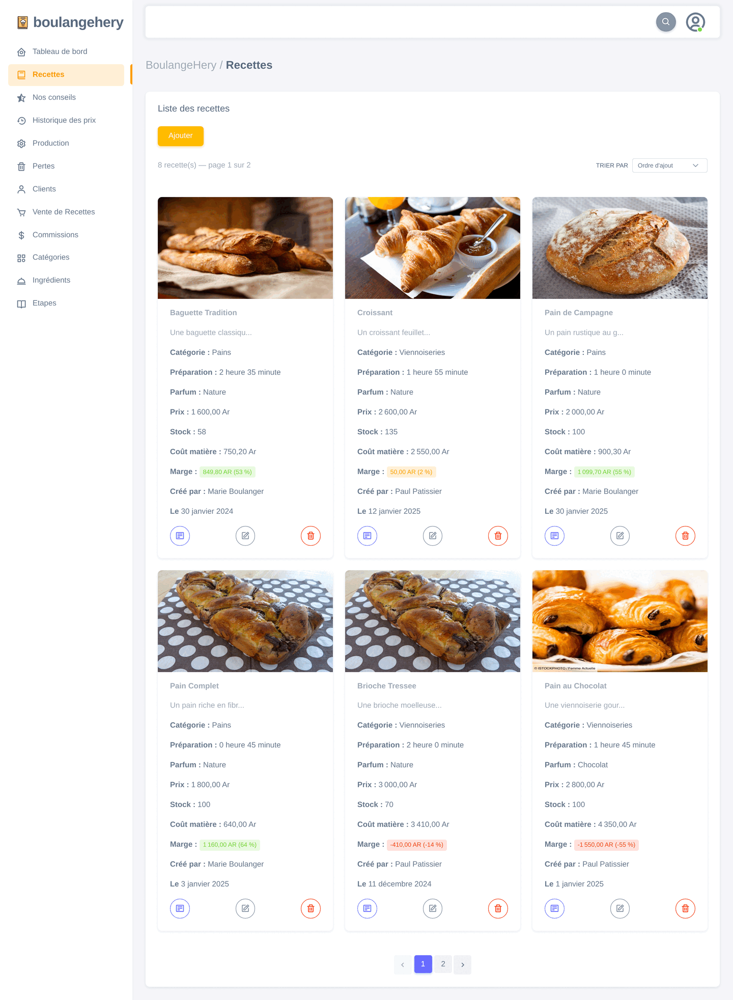

The search dialog combines every criterion at once — title, description,
category, flavour, a set of required ingredients, preparation time range,
creator, creation date range and price range. Any field left empty is simply
dropped from the generated SQL.

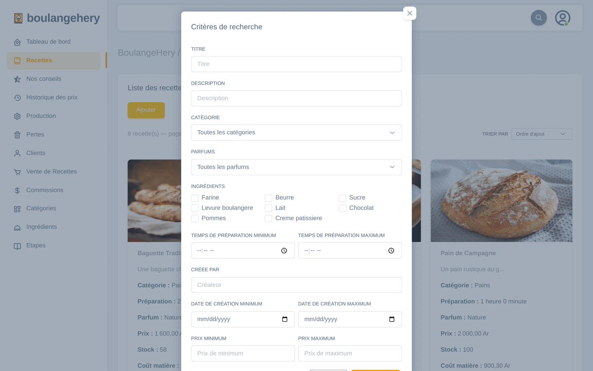

Creating and editing share one form -- including the photo, stored outside the
WAR so a redeploy does not wipe it. When the database refuses a value, the form
comes back with what was typed and the reason.

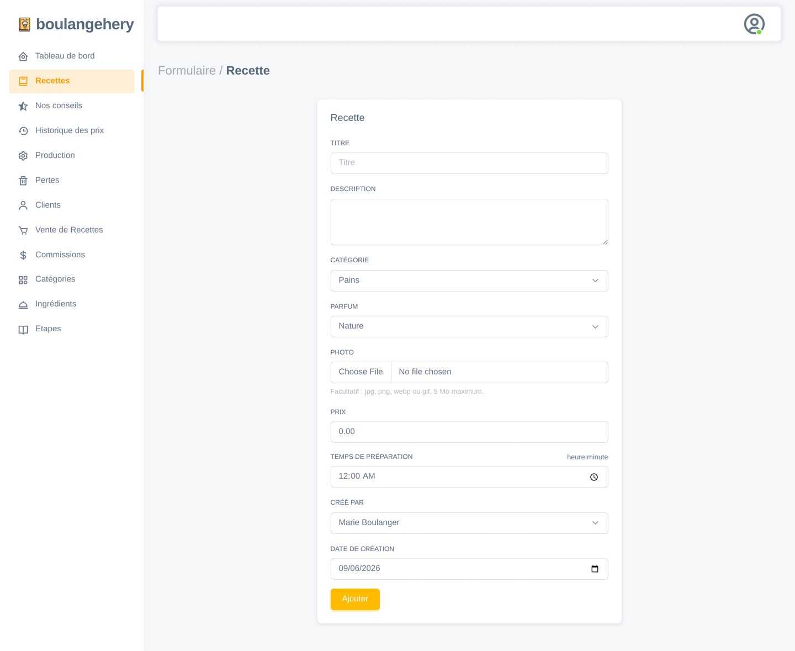

### Recipe details, stock and steps

A recipe page shows its profitability, its available stock with a replenishment
form and an alert threshold, its ingredients with their unit prices and the cost
each contributes, and its ordered steps with their individual durations.

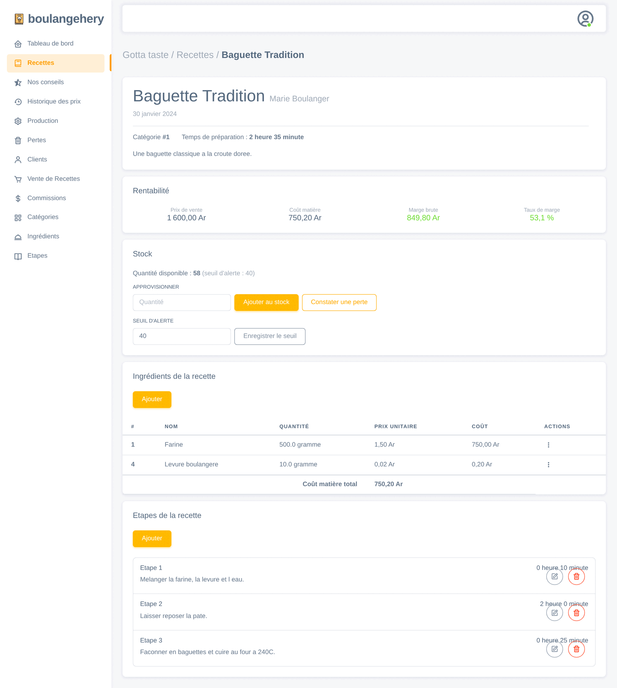

### Production and raw material stock

Stock used to cover finished goods only, replenished by hand, and nothing linked
"bake 200 baguettes" to the flour it consumes. Ingredients now carry their own
stock, and a production order deducts every ingredient of the recipe before
crediting the finished stock -- refusing the run, and naming the ingredient that
is short, when the shelf cannot cover it.

A production is insert-only: flour really left the shelf, so a mistake is
corrected by a new entry rather than by rewriting history.

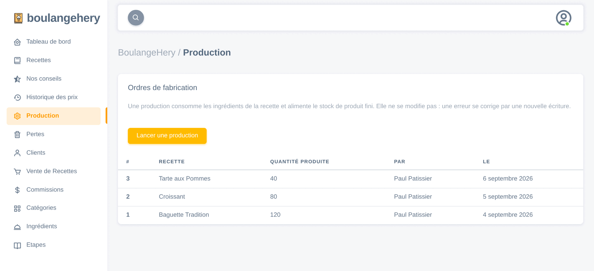

### Losses and low-stock alerts

Stock only ever went down through sales, so what goes in the bin at closing time
stayed counted as available. Unsold, breakage, expiry and giveaways are recorded
with their reason and deducted under the same rules as a sale, and every recipe
can carry an alert threshold that the list, the recipe page and the dashboard
flag.

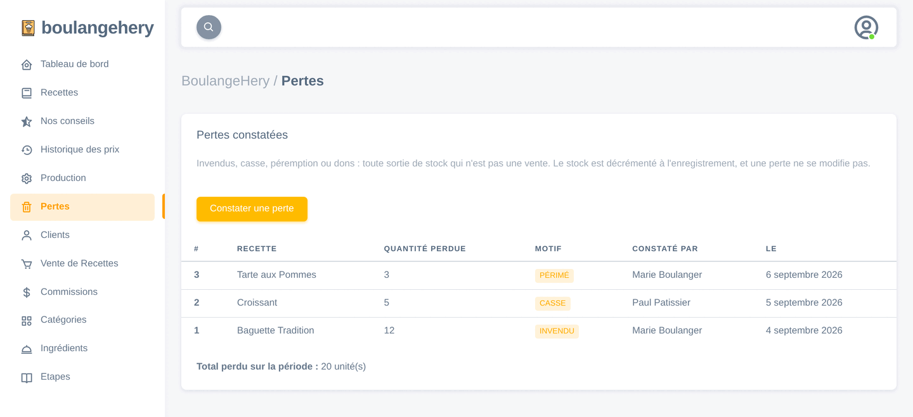

### Reviews

Reviews are rated from 1 to 5 stars, attributed to the signed-in author and
filterable by date.

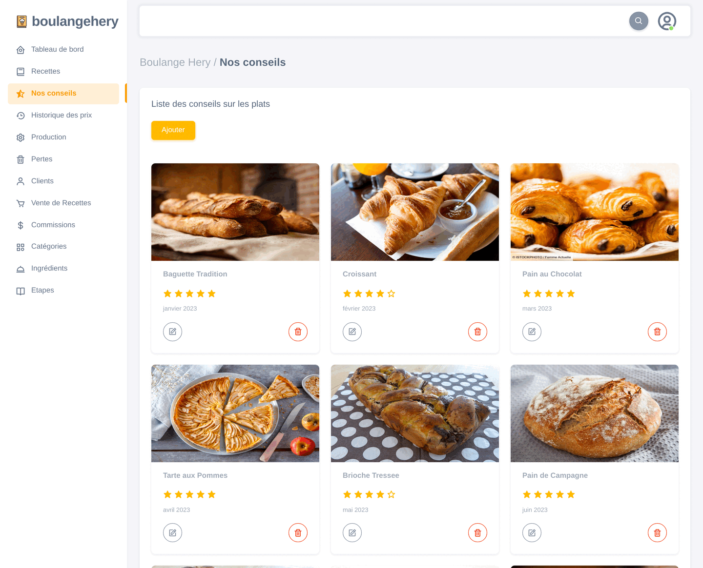

### Sales

Recording a sale is a single form. The database then computes the change due
(`money received − quantity × recipe price`), refuses the sale if the money is
short or the stock insufficient, decrements the stock, and creates the seller's
commission. Editing or deleting a sale replays all of it consistently.

A sale names a customer from the customer list, or none at all for a counter
sale. Every sale can be printed as a receipt, which shows the price actually
charged that day even if the recipe has been repriced since.

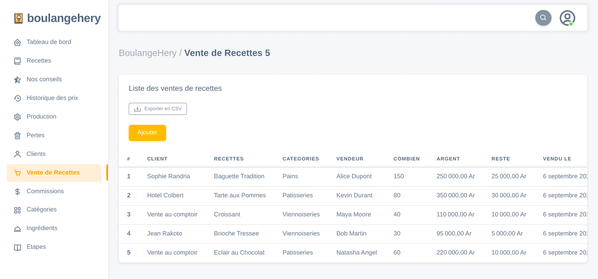


### Customers

Before, the "customer" column of the sales list pointed at application accounts,
so the customers on screen were the employees. Customers are now their own
records -- searchable, and protected from deletion while sales reference them.

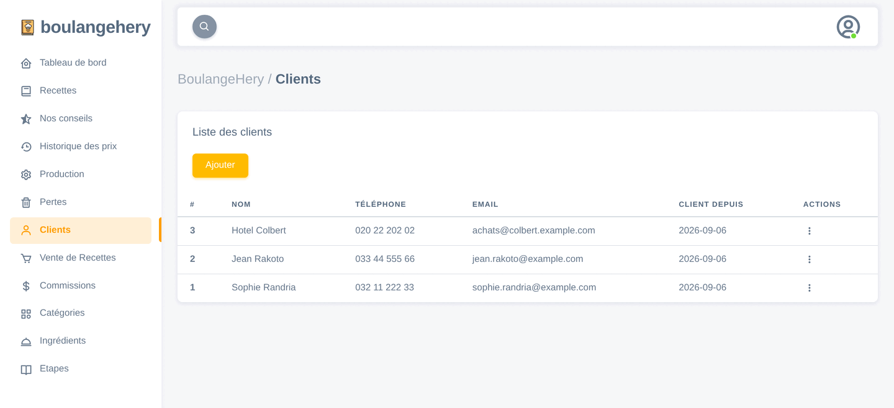

### Commissions

Commissions are derived from sales, never entered. The applicable rule is the
most recent one *dated on or before the sale date*, so back-dated sales keep the
percentage that was in force at the time. A sale below the rule's threshold
earns nothing. The list can be filtered by seller, recipe, period and seller
gender, and totals the amount at the bottom.

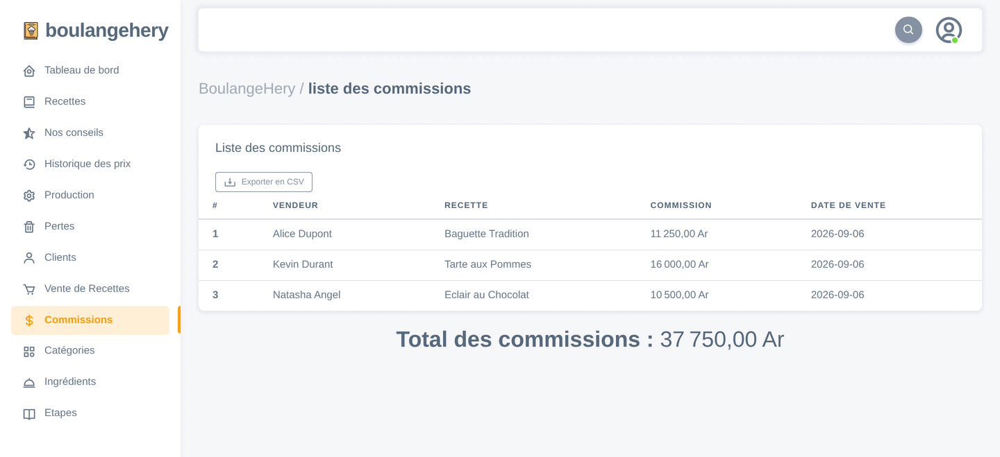

Sales and commissions export to CSV with the criteria currently on screen:
semicolon-separated with a UTF-8 BOM, which is what Excel expects in a French
setup, and cells starting with `=`, `+`, `-` or `@` are neutralised so a
spreadsheet treats them as text rather than formulas.

### Price history

Every price change on a recipe is journalled automatically, with the previous
price, the new price and the day of the change.

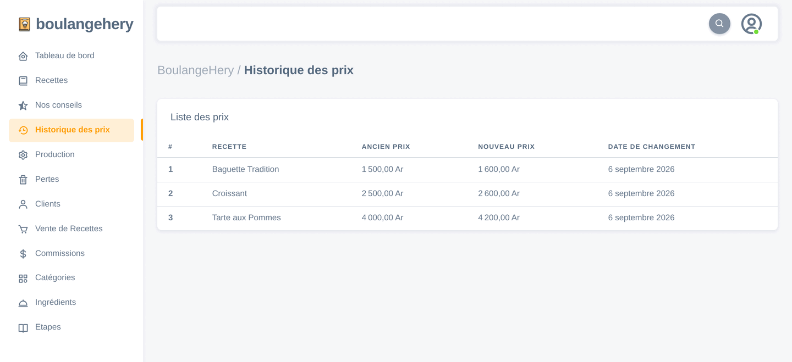

### Reference data

Categories, flavours, ingredients (with unit, unit price and raw-material stock)
and steps each have their own CRUD screen. Deleting a row that is still referenced is refused with a
readable message instead of a stack trace, and duplicates are rejected by unique
constraints.

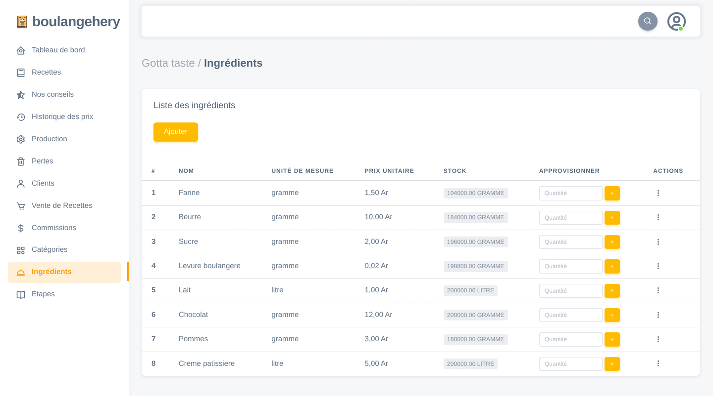

### Sign-in

Browsing the catalogue (recipes, reviews, categories, ingredients, steps) is
public. Everything else — any change, and the financial pages (sales,
commissions, price history) — requires an account and a role that allows it.

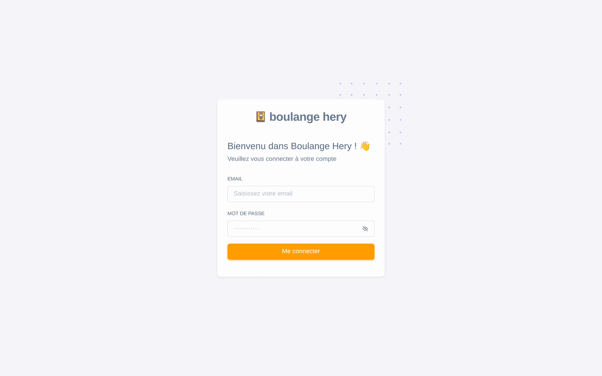

## Roles

Access used to be all-or-nothing: any signed-in account could delete a recipe
and read every commission. Accounts now carry one of three roles.

| Role | Can reach |
|---|---|
| `ADMIN` | Everything |
| `BOULANGER` | Recipes, steps, ingredients, categories, stock, production, losses, price history |
| `VENDEUR` | Sales, customers, commissions, exports, receipts |

`AuthFilter` is the single choke point: it maps each path to the roles allowed
on it, and a path missing from that map is admin-only, which closes a new page
by default. The menu and the action buttons follow the same rule, so nothing on
screen leads to a 403.

## Tech stack

| Layer | Choice |
|---|---|
| Language | Java 21 |
| Web | Jakarta Servlet 6 / JSP (scriptlets, no JSTL) on Apache Tomcat 10.1 |
| Database | PostgreSQL 14 or later (`CREATE OR REPLACE TRIGGER`) |
| Data access | Plain JDBC, one DAO class per table |
| Connection pool | Tomcat's bundled DBCP2, exposed as the JNDI resource `jdbc/boulangerie` |
| UI | Bootstrap 5, "Sneat" template (vendored under `web/assets/`) |
| Build | `javac` + `jar` driven by `deploy.bat` — no Maven, no Gradle |

The only jars are `lib/postgresql-42.6.0.jar` (shipped in the WAR) and
`lib/servlet-api.jar` (compile-time only; Tomcat provides it at runtime).

## Getting started

### Prerequisites

- JDK 21
- Apache Tomcat 10.1 (Jakarta EE 9+ namespace — Tomcat 9 will **not** work)
- PostgreSQL 14+

### 1. Create the database

```
psql -U postgres -f sql/1-schema.sql                  # creates the gotta_taste database and its tables
psql -U postgres -d gotta_taste -f sql/2-trigger.sql  # business rules
psql -U postgres -d gotta_taste -f sql/3-data.sql     # demo data (optional)
```

`1-schema.sql` starts with `DROP DATABASE IF EXISTS gotta_taste` and `3-data.sql`
with a `TRUNCATE … CASCADE`: both are destructive. To upgrade an **existing**
database instead, apply `sql/migrations/` in numerical order — see
[Schema migrations](#schema-migrations).

A dedicated role is recommended over `postgres`:

```sql
CREATE ROLE boulangerie_app LOGIN PASSWORD '…';
GRANT CONNECT ON DATABASE gotta_taste TO boulangerie_app;
GRANT SELECT, INSERT, UPDATE, DELETE ON ALL TABLES IN SCHEMA public TO boulangerie_app;
GRANT USAGE, SELECT ON ALL SEQUENCES IN SCHEMA public TO boulangerie_app;
```

### 2. Configure the database credentials

The repository contains no credentials. Three values are read as JVM system
properties (which win) or as environment variables:

| System property | Environment variable | Example |
|---|---|---|
| `boulangerie.db.url` | `BOULANGERIE_DB_URL` | `jdbc:postgresql://localhost:5432/gotta_taste` |
| `boulangerie.db.user` | `BOULANGERIE_DB_USER` | `boulangerie_app` |
| `boulangerie.db.password` | `BOULANGERIE_DB_PASSWORD` | — |

Under Tomcat, connections come from the JNDI pool declared in
`web/META-INF/context.xml`; Tomcat substitutes its `${boulangerie.db.*}`
placeholders from the system properties. Set them in a `setenv` script next to
Tomcat's `catalina` script — that file is not part of this repository and must
not be committed.

`%CATALINA_HOME%\bin\setenv.bat`:

```bat
set "CATALINA_OPTS=-Dboulangerie.db.url=jdbc:postgresql://localhost:5432/gotta_taste -Dboulangerie.db.user=boulangerie_app -Dboulangerie.db.password=..."
```

`$CATALINA_HOME/bin/setenv.sh`:

```bash
export CATALINA_OPTS="-Dboulangerie.db.url=jdbc:postgresql://localhost:5432/gotta_taste \
                      -Dboulangerie.db.user=boulangerie_app \
                      -Dboulangerie.db.password=..."
```

Outside a container (command-line tools, tests), `dao.DBConnection` falls back to
`DriverManager` with the same settings, so the environment variables are enough.

Uploaded recipe photos are written outside the WAR so a redeploy does not wipe
them: `boulangerie.picture.dir` if set, otherwise
`<catalina.base>/boulangerie-pictures`. They are served under `/pictures/`.

### 3. Build and deploy

On Windows:

```bat
set CATALINA_HOME=C:\path\to\tomcat
deploy.bat     :: compiles src/, builds boulangerie.war, copies it into %CATALINA_HOME%\webapps
run.bat        :: starts Tomcat and opens the application
```

`deploy.bat` also honours `WEB_APPS` if the target `webapps` directory is
elsewhere. It excludes `servlet-api.jar` from the WAR, since Tomcat supplies it.

There is no shell equivalent of the batch scripts; on Linux or macOS the same
build is five commands:

```bash
CATALINA_HOME=/path/to/tomcat
rm -rf build && mkdir -p build/WEB-INF/lib build/WEB-INF/classes
cp -r web/. build/ && cp web.xml build/WEB-INF/ && cp lib/postgresql-*.jar build/WEB-INF/lib/
javac -d build/WEB-INF/classes -cp "lib/*" $(find src -name '*.java')
(cd build && jar cf ../boulangerie.war .) && cp boulangerie.war "$CATALINA_HOME/webapps/"
"$CATALINA_HOME/bin/startup.sh"
```

To only check that everything still compiles:

```bash
javac -d /tmp/classes -cp "lib/*" $(find src -name '*.java')
```

### 4. Open the application

<http://localhost:8080/boulangerie/> (the context path is the WAR name).

## User accounts

Passwords are stored as PBKDF2-HMAC-SHA256 hashes (210 000 iterations, random
salt per password, iteration count embedded in the stored value so it can be
raised later without invalidating existing hashes).

`tools.UserAdmin` manages accounts from the command line; it needs the compiled
classes (`temp\WEB-INF\classes`, produced by `deploy.bat`) and the database
configuration in the environment:

```
java -cp "temp\WEB-INF\classes;lib\*" tools.UserAdmin create <first> <last> <email> <password> [ADMIN|BOULANGER|VENDEUR]
java -cp "temp\WEB-INF\classes;lib\*" tools.UserAdmin role <email> <ADMIN|BOULANGER|VENDEUR>
java -cp "temp\WEB-INF\classes;lib\*" tools.UserAdmin list
java -cp "temp\WEB-INF\classes;lib\*" tools.UserAdmin hash <password>
java -cp "temp\WEB-INF\classes;lib\*" tools.UserAdmin rehash
```

`rehash` converts passwords still stored in clear text (databases predating
migration 004). Run it once. Plain-text passwords are always rejected at sign-in,
so an unconverted account cannot log in.

The demo data creates one account per role, with passwords written in clear text
in the comments of `3-data.sql` — `marie.boulanger@example.com` / `pain123` is
the `ADMIN`, the other two are a `BOULANGER` and a `VENDEUR`.
**They are meant for local use only and must never reach production.**

## Verifying the database rules

Because the business rules live in the database, they are tested there.
`sql/tests/triggers_smoke_test.sql` runs a full scenario inside a transaction
that is rolled back at the end, so it leaves no trace. Each rule raises an
`ASSERT` if it does not behave as expected; a clean run prints `OK` for each one.

```
psql -U postgres -d gotta_taste -v ON_ERROR_STOP=1 -f sql/tests/triggers_smoke_test.sql
```

It expects a database loaded with the demo data, and covers stock, sales, change
due, commissions (including threshold and back-dated rules), price history,
preparation time, unique constraints, cascade deletes, `RESTRICT` protections,
material cost, account roles, production and losses. It reasons in deltas and
reads the current prices and commission rule rather than assuming the seeded
values, so the demo data can grow without breaking it.

This is the project's only automated test suite; there are no Java unit tests.

## Architecture

### Request pipeline

```
request → ErrorFilter → CsrfFilter → AuthFilter → servlet → DAO → PostgreSQL
                                                      ↓
                                                     JSP
```

- **`ErrorFilter`** — last line of defence: logs unhandled exceptions and returns
  a clean `400` or `500` instead of letting Tomcat print a stack trace.
- **`CsrfFilter`** — rejects any `POST`/`PUT`/`PATCH`/`DELETE` without the
  session's anti-CSRF token.
- **`AuthFilter`** — single access-control rule: everything requires a session,
  except non-mutating `GET`s on public pages, the sign-in page and static assets.

All three are declared in `web.xml`, which is `metadata-complete="true"` —
`@WebServlet` annotations are **not** scanned. Adding a servlet means adding the
class plus its `<servlet>` and `<servlet-mapping>` entries.

### Layers

| Package | Role |
|---|---|
| `dao` | One class per table: entity fields *and* JDBC access (`all`, `findById`, `search`, `create`, `update`, `delete`) |
| `servlet` | HTTP entry points. `XxxServlet` lists and mutates, `FormXxxServlet` renders the create/edit form |
| `util` | Typed request parameters, session helpers, HTML escaping, CSRF tokens, password hashing, money and CSV formatting, JSON for the charts, uploaded pictures |
| `tools` | Command-line utilities |

Servlets follow post/redirect/get: `doPost` writes then redirects. When a write
is refused, the servlet forwards back to the form with the submitted values and a
readable message instead.

Search methods share one convention: a criterion is "not set" when it is `0`
(numbers), `null` (dates and times) or `""` (text), and is then left out of the
SQL entirely.

### Business rules live in the database

`sql/2-trigger.sql` is the reference for what the application guarantees:

| Rule | Effect |
|---|---|
| `recipe.cook_time` | Always the sum of the recipe's steps, recomputed on insert, update and delete |
| `recipe_stock` | One row per recipe, created with the recipe; sales decrement it, edits and deletions give the units back |
| Stock check | The decrement is atomic under a row lock, so two concurrent sales can never drive the stock negative |
| `recipe_sell.reste` | Change due, computed as `argent − combien × price`; a `CHECK` rejects a sale paid short |
| `commission` | Created per sale from the rule in force at the sale date, above the rule's threshold; deleted with its sale |
| `recipe_price_history` | One row per price change, dated the day of the change |
| `ingredient_stock` | One row per ingredient, created with it |
| `production` | Deducts every ingredient of the recipe, then credits the finished stock; refused, naming the ingredient, when the raw material is short |
| `recipe_loss` | Unsold, breakage, expiry or giveaway; deducted from the finished stock, never beyond what is left |
| `recipe_cost` (view) | Material cost per recipe: quantity × unit price, following prices and composition |

Refusals are `RAISE EXCEPTION`s whose message is written for the end user and
displayed as-is.

### Error handling

Each kind of failure has its own exception and its own outcome:

| Exception | Raised by | Result for the user |
|---|---|---|
| `util.BadRequestException` | A missing or malformed request parameter | `400` with a neutral error page |
| `dao.BusinessRuleException` | A trigger (`P0001`) or a `CHECK` constraint (`23514`) | The form again, with the rule's message and the submitted values |
| `dao.DuplicateEntityException` | A unique constraint (`23505`) | The form again, "this name already exists" |
| `dao.EntityInUseException` | A foreign key still referencing the row (`23503`, or `23001` for `RESTRICT` on PostgreSQL 18+) | The list again, "this row is still in use" |
| anything else | — | Logged server-side, neutral `500`; no stack trace or SQL ever reaches the browser |

## Security

- **Passwords**: PBKDF2-HMAC-SHA256, 210 000 iterations, per-password salt,
  constant-time comparison. No credentials in the source tree.
- **CSRF**: a per-session synchronizer token in every mutating form; deletions
  are `POST`s, never links. Cookies are `SameSite=Lax`.
- **XSS**: every dynamic value printed by a JSP goes through `util.Html.esc`.
- **Sessions**: the session id is rotated on sign-in (anti-fixation), destroyed
  on sign-out, expires after 30 minutes, and its cookie is `HttpOnly`.
  Switch the cookie to `secure` in `web.xml` once the app is served over HTTPS.
- **SQL**: every query is a `PreparedStatement`; no string concatenation of
  user input.
- **Uploads**: the browser's file name is never reused -- only its extension,
  and only from a known image list; `PictureServlet` serves generated names
  alone, refuses anything else without touching the disk, and an oversized
  upload is answered `400` rather than `500`.
- **Roles**: enforced in `AuthFilter`, closed by default for unlisted paths.
- **Errors**: neutral pages, details in the server log only.

## Database

| Table | Holds |
|---|---|
| `gotta_taste_user` | Application accounts (hashed passwords) |
| `category`, `perfume` | Recipe classification |
| `recipe` | Recipes, with price and picture |
| `ingredient`, `recipe_ingredient` | Ingredients (unit, unit price) and per-recipe quantities |
| `step` | Ordered steps and their durations |
| `review` | Ratings (1–5) and comments |
| `vendeur` | Sellers |
| `recipe_sell` | Sales |
| `commission`, `commission_change` | Commissions earned, and the rules that produce them |
| `recipe_stock` | Available stock per recipe, with its alert threshold |
| `ingredient_stock` | Raw material available per ingredient |
| `production` | Production runs |
| `recipe_loss` | Stock written off, with its reason |
| `client` | Customers |
| `recipe_price_history` | Price changes |

Deletion policies are explicit: a recipe's own parts (steps, ingredient links,
reviews, stock, price history) are removed with it (`ON DELETE CASCADE`), while
anything referenced by financial records is protected (`ON DELETE RESTRICT`).

### Schema migrations

`1-schema.sql`, `2-trigger.sql` and `3-data.sql` always describe the **current**
state and are meant for fresh installs. An existing database is upgraded only by
the numbered scripts in `sql/migrations/`, applied in order — each is written to
be safely re-runnable.

| # | Change |
|---|---|
| 001 | Commission uses the rule in force at the sale date |
| 002 | Explicit `ON DELETE` policies |
| 003 | Price history dated the day of the change |
| 004 | Hashed passwords (wider column + `tools.UserAdmin rehash`) |
| 005 | One stock row per recipe, sales editable/deletable without corrupting stock or commissions |
| 006 | Unique constraints (emails, category and flavour names, ingredient+unit, step number per recipe) |
| 007 | `ingredient.price` as `NUMERIC(10,2)` (the old `INT` rounded unit prices) |
| 008 | `recipe_cost` view: material cost per recipe |
| 009 | Indexes on foreign keys and the columns searches filter on |
| 010 | Account roles (ADMIN, BOULANGER, VENDEUR) |
| 011 | Raw-material stock and production orders |
| 012 | Losses (unsold, breakage…) and stock alert threshold |
| 013 | Recipe author linked to a user account |
| 014 | `client` table, and sales linked to it |

Any change to the schema or the triggers must update the current-state scripts
**and** add a numbered migration **and** a row in `sql/migrations/README.md`.

## Project layout

```
src/dao/          entities + JDBC access, one class per table
src/servlet/      servlets and the three filters
src/util/         parameters, session, HTML escaping, CSRF, password hashing
src/tools/        UserAdmin command-line tool
web/              JSP pages and static assets
web/assets/js/    dashboard.js — the dashboard charts
web/META-INF/     context.xml — the JDBC connection pool
web.xml           servlet mappings, filters, session policy, error pages
sql/              schema, triggers, demo data
sql/migrations/   incremental upgrades for existing databases
sql/tests/        trigger and constraint scenario
lib/              postgresql driver, servlet API (compile only)
deploy.bat        build + deploy the WAR
run.bat           start Tomcat and open the app
docs/screenshots/ images used by this README
aleas/            log of change requests received during the project
todo.md           original specification checklist
```

`html/` holds an obsolete copy of early pages from the UI template. It is not
deployed — `deploy.bat` only packages `web/`.

## URL map

| Path | Method | Access | Purpose |
|---|---|---|---|
| `/dashboard` | GET | signed in | Indicators and charts, adapted to the role |
| `/recipe` | GET / POST | public / signed in | Recipe list and search / create, update, delete |
| `/recipe-details` | GET | public | One recipe: stock, ingredients, steps |
| `/form-recipe` | GET | signed in | Recipe form |
| `/recipe-ingredient`, `/form-recipe-ingredient` | GET / POST | signed in | Ingredients of a recipe |
| `/step`, `/form-step` | GET / POST | public / signed in | Steps |
| `/review`, `/form-review` | GET / POST | public / signed in | Reviews |
| `/category`, `/form-category` | GET / POST | public / signed in | Categories |
| `/ingredient`, `/form-ingredient` | GET / POST | public / signed in | Ingredients |
| `/recipe-stock` | POST | baker | Replenish a recipe's stock, set its alert threshold |
| `/ingredient-stock` | POST | baker | Replenish a raw material |
| `/production`, `/form-production` | GET / POST | baker | Production runs |
| `/recipe-loss`, `/form-recipe-loss` | GET / POST | baker | Losses |
| `/pictures/*` | GET | public | Uploaded recipe photos |
| `/recipe-sell`, `/form-recipe-sell` | GET / POST | seller | Sales |
| `/commission` | GET | seller | Commissions and totals |
| `/client`, `/form-client` | GET / POST | seller | Customers |
| `/export` | GET | seller | CSV of sales or commissions |
| `/receipt` | GET | seller | Printable receipt for one sale |
| `/recipe-price-history` | GET | baker | Price changes |
| `/form-login` | GET | public | Sign-in form |
| `/login` | POST | public | Sign in (and sign out, `action=logout`) |

`aleas/` records the change requests that shaped the sales, commission and price
history features; `todo.md` is the original specification, fully checked off.
